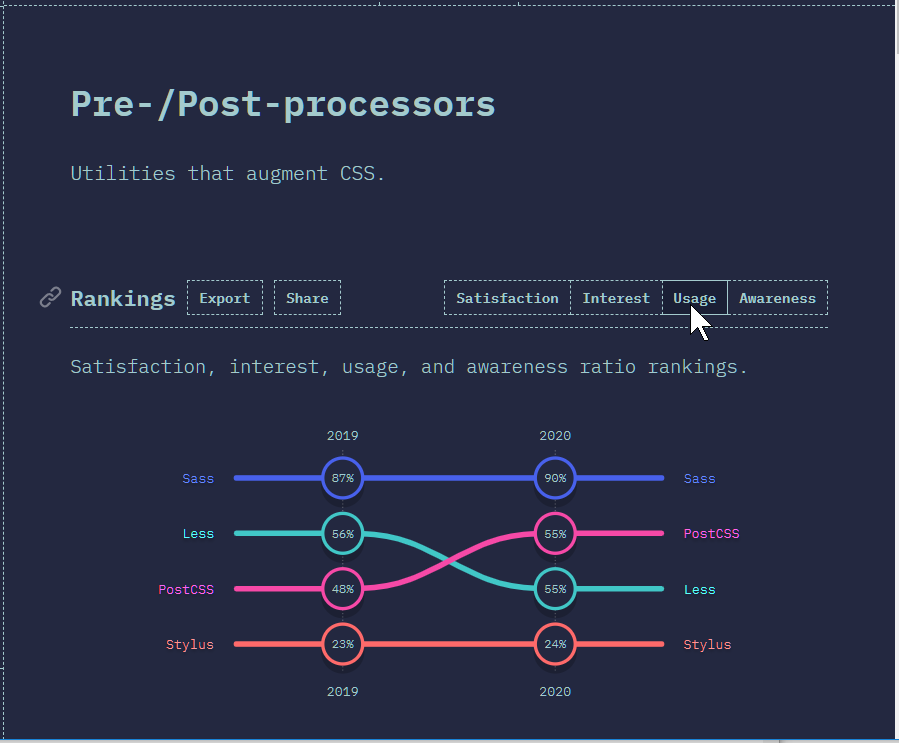

# Les 12: CSS - preprocessors - frameworks

Deze laatste les bestaat uit twee workshops.

De eerste workshop **01_sass_workshop.pdf** bespreekt kort de CSS preprocessor [SASS](https://sass-lang.com/) en in de tweede workshop **02_bootstrap_workshop.pdf** leer je werken met het CSS framework [Bootstrap](https://getbootstrap.com/).

Volgens de website [https://stateofcss.com/](https://stateofcss.com/) is SASS momenteel de meest gebruikte [CSS preprocessor](https://developer.mozilla.org/en-US/docs/Glossary/CSS_preprocessor) en is Bootstrap het meest gebruikte [CSS Framework](https://en.wikipedia.org/wiki/CSS_framework) (zie hieronder).

BRON: [https://2020.stateofcss.com/en-US/technologies/pre-post-processors/](https://2020.stateofcss.com/en-US/technologies/pre-post-processors/)

BRON: [https://2020.stateofcss.com/en-US/technologies/css-frameworks/](https://2020.stateofcss.com/en-US/technologies/css-frameworks/)

